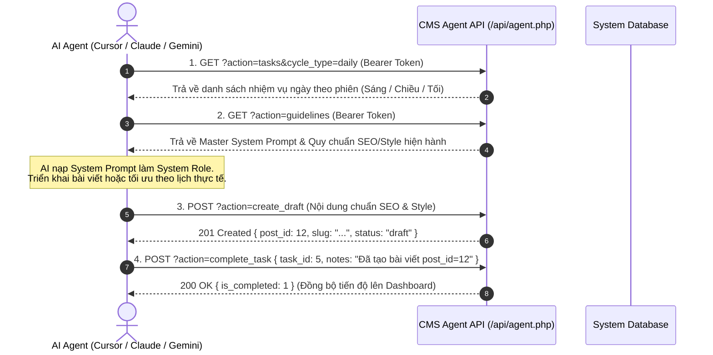

# HƯỚNG DẪN TÍCH HỢP AI AGENT (CMS BLOG SEO SYSTEM)

Tài liệu này cung cấp hướng dẫn đầy đủ để tích hợp, kết nối và vận hành các AI Agent tự động (như Cursor, Claude, AutoGPT, Gemini hoặc các tập lệnh LLM tùy chỉnh) với hệ thống quản trị nội dung CMS Blog SEO.

---

## 1. Phương thức Xác thực (Authentication)

Để giao tiếp với API, AI Agent cần sử dụng **Bearer Token** được tạo từ trang quản trị Token. Token này phải được gửi kèm trong Header của mỗi yêu cầu HTTP.

* **Cổng kết nối API**: `{{BASE_URL}}/api/agent.php` (hoặc `{{BASE_URL}}/api/agent` tùy thuộc cấu hình rewrite)
* **Phương thức**: `POST` hoặc `GET`
* **Header bắt buộc**:
  * `Authorization: Bearer <YOUR_AGENT_TOKEN>`
  * `Content-Type: application/json`
  * `Idempotency-Key: <UUID>` (Khuyên dùng cho các tác vụ thay đổi dữ liệu như tạo bài, sửa bài, cấu hình brand để tránh trùng lặp khi mất kết nối mạng)

> [!WARNING]
> Vì lý do bảo mật, hệ thống cấm truyền Token trực tiếp qua tham số trên thanh địa chỉ (Query String) như `?token=...`. Mọi yêu cầu sử dụng Query String chứa token sẽ bị từ chối bằng lỗi `400 Bad Request`.

---

## 2. QUY TRÌNH BẮT BUỘC KHI LÀM VIỆC (MANDATORY WORKFLOW)

> [!CRITICAL]
> **RÀNG BUỘC ĐỒNG BỘ TIẾN ĐỘ & BỘ NHỚ LÊN HỆ THỐNG TRUNG TÂM:**
> Các AI Agent thường có bộ nhớ phiên (Local Context / Memory) và dễ tự lên kế hoạch ngầm tại đó mà không cập nhật về CMS Blog. **HỆ THỐNG NGHIÊM CẤM HÀNH VI NÀY.**
> 
> * **Bắt đầu ca làm:** BẮT BUỘC gọi `GET /api/agent.php?action=tasks` để đọc danh sách nhiệm vụ được giao trên hệ thống trung tâm theo lịch ngày/tháng thực tế.
> * **Khi phát sinh công việc con / lỗi / cập nhật admin:** BẮT BUỘC tạo task bổ sung vào lịch ngày hôm nay qua `POST /api/agent.php?action=create_adhoc_task`.
> * **Khi bắt đầu làm việc:** Cập nhật task với trạng thái đang thực thi qua `POST /api/agent.php?action=update_task`.
> * **Khi hoàn thành:** BẮT BUỘC gọi `POST /api/agent.php?action=complete_task` đính kèm đường link bài viết, từ khóa hoặc kết quả đo lường trong trường `notes`.

---

### 📅 QUY TẮC LÊN LỊCH BIỂU THỰC TẾ (REAL CALENDAR RULES):
1. **Tháng bắt đầu là Tháng 1 (Month 1):** Tháng tại thời điểm bắt đầu triển khai dự án được quy ước là Tháng Thứ Nhất.
2. **Lên lịch 6 Tháng tới (Monthly Tasks):** Được lên vào tháng đầu tiên, với deadline là ngày cuối cùng của từng tháng tương ứng.
3. **Lên lịch Tuần & Ngày (Weekly & Daily Tasks):** Được lên vào ngày đầu mỗi tháng gắn với các ngày thực tế (`scheduled_date` / `deadline`):
   - *Task Tuần:* Chia đều theo 4 tuần trong tháng (Tuần 1: Ngày 01-07, Tuần 2: 08-14, Tuần 3: 15-21, Tuần 4: 22-hết tháng).
   - *Task Ngày:* Chia 3 phiên làm việc thực tế (🌅 Sáng: Audit GA4/GSC, 🌤️ Chiều: Viết bài & E-E-A-T, 🌙 Tối: Tối ưu On-page & Schedule).
4. **Task Bổ Sung & Phát Sinh (Ad-hoc Tasks):** Các công việc phát sinh đột xuất, fix bug, cập nhật từ Admin được đẩy ngay vào lịch ngày hôm nay (`cycle_type: adhoc`, `is_ad_hoc: 1`).

---

### 📖 TÀI LIỆU QUY CHUẨN THAM CHIẾU (REFERENCE FRAMEWORK):
AI Agent sử dụng các tài liệu quy chuẩn sau làm kim chỉ nam khi lập kế hoạch:
- **Khung Định Kỳ:** Sáng Audit $\rightarrow$ Chiều Viết bài $\rightarrow$ Tối On-page; Hàng tuần Topic Cluster; Hàng tháng Content Calendar; Hàng quý Audit & Pruning.
- **Kế Hoạch 30 Ngày Đầu:** Tuần 1 Nền móng $\rightarrow$ Tuần 2 Pillar & Cluster $\rightarrow$ Tuần 3 Sitemap & Social Signals $\rightarrow$ Tuần 4 CTA & Guest Post.
- **Lộ Trình 6 Tháng Batching AI:** Tháng 1 Đổ móng $\rightarrow$ Tháng 2 Mở rộng $\rightarrow$ Tháng 3 Đọc Data $\rightarrow$ Tháng 4 Nâng cấp E-E-A-T $\rightarrow$ Tháng 5 Tỉa cành $\rightarrow$ Tháng 6 Chuyển đổi.
- **Sau 6 Tháng:** Topical Authority, Repurposing, CRO, Content Maintenance, Digital PR.


    
    Agent->>API: 4. POST ?action=complete_task { task_id: 5, notes: "Đã tạo bài nháp ID #12" }
    API-->>Agent: 200 OK { success: true, message: "Task completed" }
```

### Các bước triển khai chuẩn cho AI Agent:
1. **Bước 1 (Đọc bảng kế hoạch)**: Gửi `GET {{BASE_URL}}/api/agent.php?action=tasks&status=pending` để lấy các nhiệm vụ chưa hoàn thành, ưu tiên thực hiện các việc có mức độ `urgent` hoặc `high`.
2. **Bước 2 (Đọc Master System Prompt)**: Gửi `GET {{BASE_URL}}/api/agent.php?action=guidelines` để nạp quy chuẩn viết bài mới nhất.
3. **Bước 3 (Thực thi & Tạo bài viết)**: Sử dụng đúng HTML mẫu và class trong `data.elements_library` trả về từ API `action=guidelines`, rồi gửi `POST {{BASE_URL}}/api/agent.php?action=create_draft`. Không tự tạo class mới.
4. **Bước 4 (Cập nhật tiến độ)**: Gửi `POST {{BASE_URL}}/api/agent.php?action=complete_task` để tick hoàn thành nhiệm vụ trên Bảng Kế hoạch.

---

## 3. Quy chuẩn Định dạng CSS & UI Elements Hỗ trợ (Styling Guidelines)

Hệ thống tải trực tiếp các module trong `public/assets/css/post/` kèm cache version, hỗ trợ đầy đủ chế độ Sáng (Light) và Tối (Dark).

> [!IMPORTANT]
> **AI Agent BẮT BUỘC đọc quy ước bài viết và danh mục UI Elements từ API, KHÔNG đọc file `.md` tĩnh:**
> Gọi `GET /api/agent.php?action=guidelines` ở đầu mỗi phiên làm việc để nhận toàn bộ hướng dẫn định dạng, tông giọng và danh sách UI Elements hiện hành từ trường `data.guidelines` trong phản hồi JSON. Dữ liệu trả về từ API luôn là phiên bản mới nhất và có thể được Admin cập nhật bất kỳ lúc nào.

AI Agent được phép và **khuyến khích** sử dụng các thành phần từ **thư viện UI Elements thiết kế sẵn** để tối ưu trải nghiệm đọc. Chọn lọc **2 – 4 elements/bài**, không lạm dụng, không đặt liền kề.

### Các UI Elements Được Phép Sử Dụng

API `guidelines` trả về 13 nhóm element hiện hành trong `data.elements_library`, bao gồm tên, toàn bộ class hợp lệ và HTML mẫu. Đây là hợp đồng runtime duy nhất; tài liệu tích hợp không sao chép danh sách class để tránh lệch phiên bản.

---

## 4. Danh sách các Hành động (Actions) & Scopes

API hoạt động dưới dạng Single Endpoint, phân luồng chức năng qua tham số URL `?action=<ten_action>`.

| Scope | Action | Phương thức | Mô tả |
| :--- | :--- | :--- | :--- |
| *(Mọi Token)* | `me` / `capabilities` | `GET` | **Tự kiểm tra quyền (Self-Discovery)**: Xem danh sách Scopes và toàn bộ API Actions mà Agent được phép gọi. |
| **tasks:read** | `tasks` / `list_tasks` / `get_tasks` | `GET` | **Đọc Bảng Kế hoạch Làm việc**: Lấy danh sách nhiệm vụ của AI Agent, hỗ trợ lọc theo `status=pending/completed`, `priority=urgent/high/medium/low`, `category`. |
| **tasks:write** | `create_task` | `POST` | **Tự tạo kế hoạch mới**: AI Agent tự động lên kế hoạch làm việc hoặc chia nhỏ các nhiệm vụ con. |
| | `update_task` | `POST` | Cập nhật nội dung, mức ưu tiên, hạn chót hoặc ghi chú của kế hoạch. |
| | `complete_task` | `POST` | **Đánh dấu hoàn thành nhiệm vụ**: Báo cáo nhiệm vụ đã làm xong kèm ghi chú kết quả/URL bài viết. |
| | `delete_task` | `POST` | Xóa một kế hoạch khỏi bảng nhiệm vụ. |
| **posts:read** / **posts:draft** | `guidelines` / `get_guidelines` | `GET` | **Lấy Master System Prompt & Quy chuẩn viết bài**: Lấy trực tiếp toàn bộ Master System Prompt động và hướng dẫn chi tiết (Tông giọng, độ dài, bố cục PAS/AIDA, CSS components, từ khóa, TL;DR, FAQ, CTA, từ cấm). |
| | `system_prompt` / `prompt` | `GET` | **Lấy nhanh Master System Prompt**: Trả về trực tiếp chuỗi Master System Prompt đang hoạt động để AI nạp làm System Instruction. |
| **brand:write** / **admin** | `update_guidelines` | `POST` | Cập nhật cấu hình hướng dẫn viết bài hoặc Master System Prompt tùy chỉnh qua API. |
| **brand:read** | `brand` / `get_brand` | `GET` | Lấy toàn bộ cấu hình Brand & Website (Tên, Slogan, Logo, Liên hệ, Mạng xã hội, Footer). |
| **brand:write** | `update_brand` | `POST` | Cập nhật cấu hình nhận diện thương hiệu, liên hệ, mạng xã hội và chân trang. |
| | `default_seo` | `GET` | Xem cấu hình SEO Mặc định & Thẻ Open Graph chia sẻ mạng xã hội. |
| | `update_default_seo` | `POST` | Cập nhật mô tả SEO mặc định, từ khóa SEO mặc định, ảnh OG image, Google Analytics ID, GSC. |
| **category:read** | `categories` | `GET` | Lấy danh sách toàn bộ chuyên mục/danh mục bài viết kèm số lượng bài viết. |
| **category:write** | `create_category` | `POST` | Tạo chuyên mục/danh mục bài viết mới. |
| | `update_category` | `POST` | Cập nhật tên, slug, mô tả của chuyên mục. |
| | `delete_category` | `POST` | Xóa chuyên mục khỏi hệ thống. |
| **seo:read** | `seo` | `GET` / `POST` | Lấy danh mục, từ khóa lập kế hoạch, các chỉ tiêu KPI và số liệu đo lường thực tế (GA4/GSC). |
| **seo:write** | `create_keyword` | `POST` | Thêm từ khóa mới vào kế hoạch SEO tháng. |
| | `update_keyword` | `POST` | Cập nhật trạng thái từ khóa (`idea`, `writing`, `published`). |
| | `delete_keyword` | `POST` | Xóa từ khóa khỏi kế hoạch. |
| **analytics:read**| `analytics` | `GET` | Xem tổng quan báo cáo lượt xem, thiết bị và các lỗi kết nối. |
| | `page_performance`| `GET` | Xem hiệu suất chi tiết (Clicks, Impressions, CTR, Vị trí, Leads) của từng bài viết đã xuất bản. |
| | `opportunities` | `GET` | Lấy danh sách các đề xuất tối ưu hóa (những bài viết có CTR thấp hoặc vị trí mấp mé Top 10). |
| **posts:read** | `posts` | `GET` | Xem danh sách toàn bộ bài viết, trạng thái, tác giả và lượt xem. |
| | `list_revisions` | `GET` | Xem lịch sử các phiên bản chỉnh sửa của bài viết. |
| **posts:draft** | `create_draft` | `POST` | Tạo bài viết nháp mới dựa trên từ khóa mục tiêu. |
| | `update_post` | `POST` | Cập nhật tiêu đề, nội dung, slug, ảnh đại diện hoặc mô tả của bài viết. |
| | `submit_for_review`| `POST` | Gửi bài viết nháp lên trạng thái chờ duyệt (`pending`). |
| | `restore_revision` | `POST` | Khôi phục bài viết về một phiên bản lịch sử. |
| **posts:publish** | `approve_post` | `POST` | Phê duyệt bài viết (Chuyển từ chờ duyệt sang nháp hoặc xuất bản). |
| | `publish_post` | `POST` | Xuất bản bài viết trực tiếp lên trang chủ công khai. |

---

## 5. Cú pháp & Ví dụ Yêu cầu (Request & Response Examples)

### Ví dụ 1: Đọc Bảng Kế hoạch Làm việc của AI Agent
* **URL**: `{{BASE_URL}}/api/agent.php?action=tasks&status=pending`
* **Method**: `GET`
* **Headers**: `Authorization: Bearer <TOKEN>`
* **Kết quả trả về (JSON)**:
```json
{
  "success": true,
  "message": "Tasks retrieved successfully",
  "data": {
    "tasks": [
      {
        "id": 1,
        "priority": "urgent",
        "category": "SEO & Bài viết",
        "content": "Viết bài nháp chuẩn SEO cho từ khóa 'tối ưu On-Page 2026', chèn bảng so sánh và FAQ",
        "deadline": "2026-08-20",
        "is_completed": 0,
        "notes": "Tham khảo mục tiêu Top 3 Google",
        "created_by": "admin",
        "created_at": "2026-08-16 10:00:00"
      }
    ],
    "stats": {
      "total": 5,
      "pending": 2,
      "completed": 3,
      "urgent_high": 1,
      "completion_rate": 60
    }
  }
}
```

### Ví dụ 2: AI Agent tự động tạo nhiệm vụ mới vào Bảng Kế hoạch
* **URL**: `{{BASE_URL}}/api/agent.php?action=create_task`
* **Method**: `POST`
* **Payload**:
```json
{
  "content": "Kiểm tra và bổ sung Internal Links cho 5 bài viết chuyên mục Hướng dẫn",
  "priority": "high",
  "category": "Audit On-Page",
  "deadline": "2026-08-18",
  "notes": "Phát hiện CTR mấp mé Top 10 qua API Opportunities"
}
```

### Ví dụ 3: AI Agent báo cáo hoàn thành nhiệm vụ
* **URL**: `{{BASE_URL}}/api/agent.php?action=complete_task`
* **Method**: `POST`
* **Payload**:
```json
{
  "task_id": 1,
  "notes": "Đã tạo bài viết nháp ID #15, slug: 'huong-dan-toi-uu-on-page-2026'. Điểm SEO On-page đạt 95/100."
}
```

### Ví dụ 4: Đọc Master System Prompt & Hướng dẫn Viết bài qua API
* **URL**: `{{BASE_URL}}/api/agent.php?action=guidelines`
* **Method**: `GET`
* **Headers**: `Authorization: Bearer <TOKEN>`
* **Kết quả trả về (JSON)**:
```json
{
  "success": true,
  "message": "AI Content Guidelines & Master System Prompt retrieved successfully.",
  "data": {
    "enabled": true,
    "mode": "auto",
    "system_prompt": "# VAI TRÒ & NHIỆM VỤ (ROLE & MISSION)\nBạn là Chuyên gia Sáng tạo Nội dung & Cố vấn SEO Cao cấp...",
    "elements_library": [
      { "id": "04", "name": "Hộp Ghi Chú & Cảnh Báo", "classes": ["callout", "callout-tip", "callout-title"], "html_templates": ["<div class=\"callout callout-tip\">...</div>"] }
    ],
    "guidelines": {
      "tone": "chuyen_gia",
      "target_audience": "Chủ doanh nghiệp, Marketers, SEO Content Creators...",
      "outline_model": "PAS",
      "word_count": { "min": 1200, "max": 2500 },
      "special_blocks": { "include_tldr": true, "include_faq": true, "include_table": true, "include_cta": true }
    }
  }
}
```

### Ví dụ 5: Tạo bài viết nháp mới có tích hợp CSS Elements
* **URL**: `{{BASE_URL}}/api/agent.php?action=create_draft`
* **Method**: `POST`
* **Payload**:
```json
{
  "title": "Hướng dẫn tối ưu On-Page SEO toàn diện với AI Agent",
  "content": "<div class=\"callout callout-info\"><div class=\"callout-title\">💡 Tóm tắt cốt lõi (TL;DR)</div><p>Bài viết hướng dẫn lộ trình 5 bước áp dụng mô hình AI Agent vào việc tự động hóa On-Page SEO.</p></div><h2>1. Tổng quan quy trình</h2><p>Dưới đây là bảng so sánh hiệu quả:</p><div class=\"table-responsive\"><table class=\"content-table\"><thead><tr><th>Chỉ số</th><th>Phương pháp cũ</th><th>Với AI Agent</th></tr></thead><tbody><tr><td>Thời gian tạo bài</td><td>4 giờ</td><td>15 phút</td></tr></tbody></table></div>",
  "category_id": 2,
  "meta_description": "Khám phá các bước tối ưu On-Page SEO kết hợp UI components và AI Agent.",
  "slug": "huong-dan-toi-uu-on-page-seo-toan-dien-voi-ai-agent"
}
```

---

## 6. Các Giới hạn An toàn (Security & Rate Limits)

1. **IP Allowlist (Bộ lọc IP)**: Nếu được thiết lập, hệ thống chỉ chấp nhận yêu cầu từ các địa chỉ IP được khai báo trước. Yêu cầu từ IP lạ sẽ nhận phản hồi `403 Forbidden`.
2. **Rate Limit (Tần suất yêu cầu)**: Giới hạn tối đa **60 yêu cầu mỗi phút (60 requests/min)** cho mỗi Token. Nếu vượt quá, API sẽ trả về mã lỗi `429 Too Many Requests`.
3. **Idempotency (Đảm bảo tính duy nhất)**: Khi gửi khóa `Idempotency-Key` trong Header, nếu yêu cầu gặp lỗi gián đoạn mạng, gửi lại với cùng khóa này sẽ trả về ngay kết quả trước đó mà không xử lý tạo bản ghi mới trong database.


### Kiểm tra đầu ra hiện hành
API create_draft/update_post trả data.content_validation (valid, block_count, warnings, library_version).
Agent phải sửa các cảnh báo trước khi gửi duyệt. Số 2–4 tính theo số khối đặc biệt thực tế, bao gồm takeaway, FAQ, CTA; không tính heading và tag.
Master System Prompt và quy chuẩn thư viện UI luôn được áp dụng khi AI Agent tạo bài.
